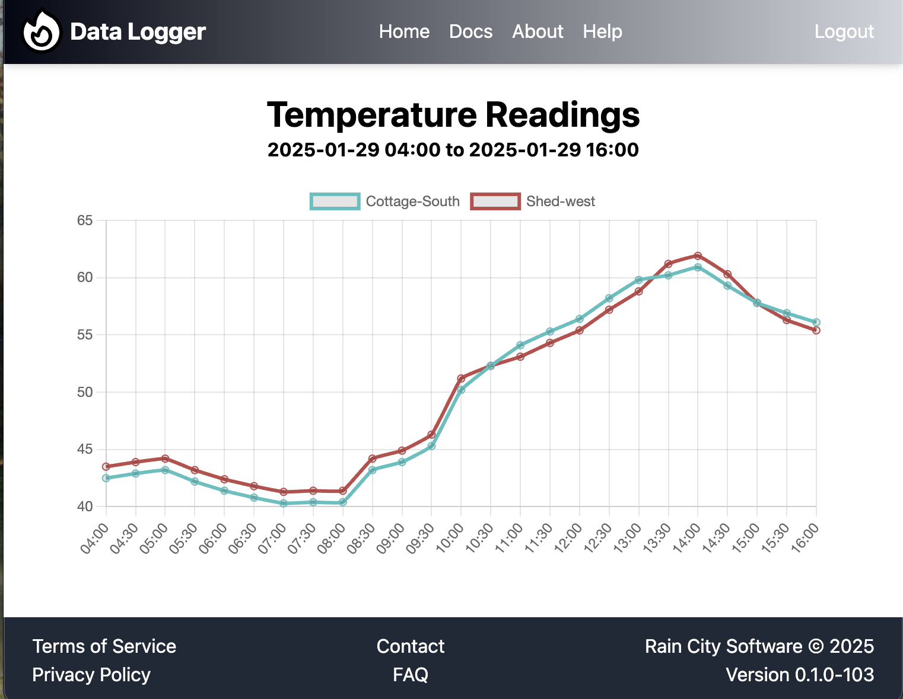

# Data Logger

```ascii
 _____         __           _____                                
|     \.---.-.|  |_.---.-. |     |_.-----.-----.-----.-----.----.
|  --  |  _  ||   _|  _  | |       |  _  |  _  |  _  |  -__|   _|
|_____/|___._||____|___._| |_______|_____|___  |___  |_____|__|  
                                         |_____|_____|           
```

## Overview

The *Data Logger* project is...

1. an arduino/esp32 micro-controller application, 
2. a data collection service (c++) and,
3. a web-app (vue3).

It initially gathers temperatures from various locations to be displayed graphically in the associated Data Logger Web Application.
Eventually it will gather and store other readings including light intensity, moisture, humidity, proximity events, etc.

## From the develop branch

Starter uses...

* basic cmake + cpm
* ansi_colors.hpp
* cxxopts.hpp
* spdlog for logging
* spdlog/fmt/fmt for formatting
* toml.hpp for config
* testlib.hpp for unit testing
* nlohmann/json (needs to be brew'd or compiled on linux)

* brew install fmt spdlog nlohmann-json openssl brotli
* sudo apt install libfmt-dev libspdlog-dev nlohmann-json3-dev libssl-dev libbrotli-dev -y

## Temperature Wiring Diagram


## Temperature Circuit Schematic 


## Arduino/Esp32-S3 Code

_copy here with tests_

## Web App



###### 2025.01.29 | dpw

