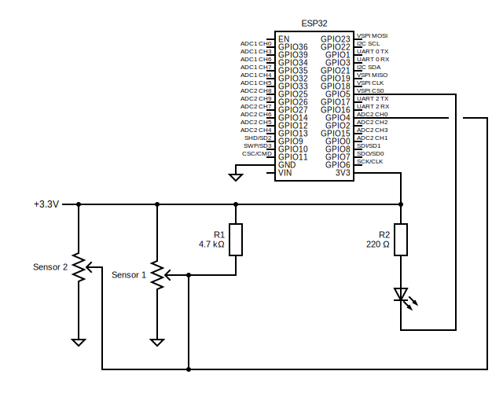

# Temperature Data Logger


```
 _______                                     __                      _____               
|_     _|.-----.----.-----.-----.----.---.-.|  |_.--.--.----.-----. |     |_.-----.-----.
  |   |  |  -__|   _|  _  |  -__|   _|  _  ||   _|  |  |   _|  -__| |       |  _  |  _  |
  |___|  |_____|__| |   __|_____|__| |___._||____|_____|__| |_____| |_______|_____|___  |
                    |__|                                                          |_____|
```

## Overview

The *Temperature Data Logger* is 1) an arduino/esp32 micro-controller application, 2) a data collection service (c++) and 3) a web-app (vue3).

## From the develop branch

Starter uses...

* basic cmake + cpm
* ansi_colors.hpp
* cxxopts.hpp
* spdlog for logging
* spdlog/fmt/fmt for formatting
* toml.hpp for config
* testlib.hpp for unit testing
* nlohmann/json (needs to be brew'd or compiled on linux)


## Temperature Wiring Diagram


## Temperature Circuit Schematic 



## Arduino/Esp32-S3 Code

_copy here with tests_

## Web App

_from starter with chart.js_

###### 2025.01.28 | dpw

